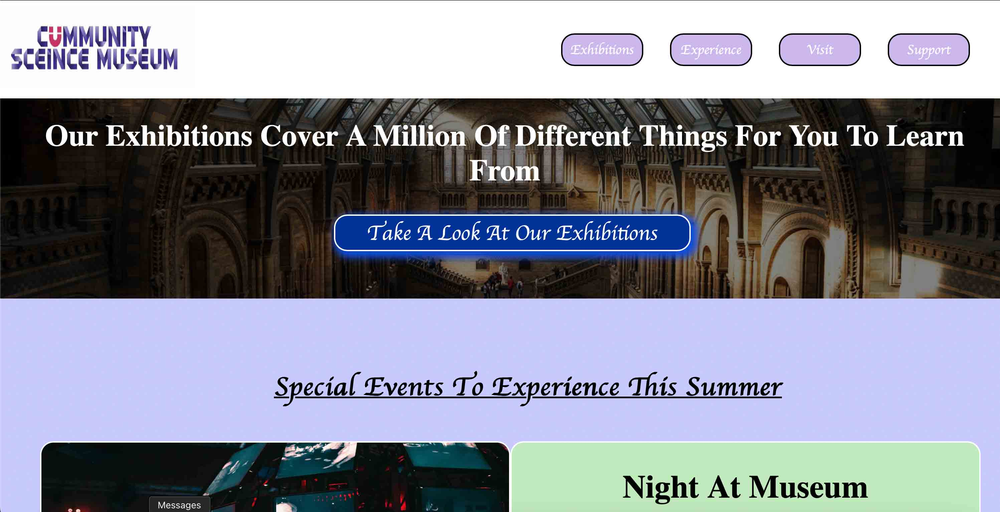
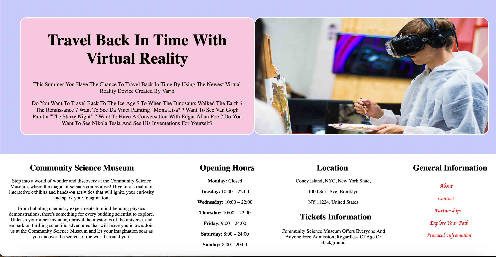
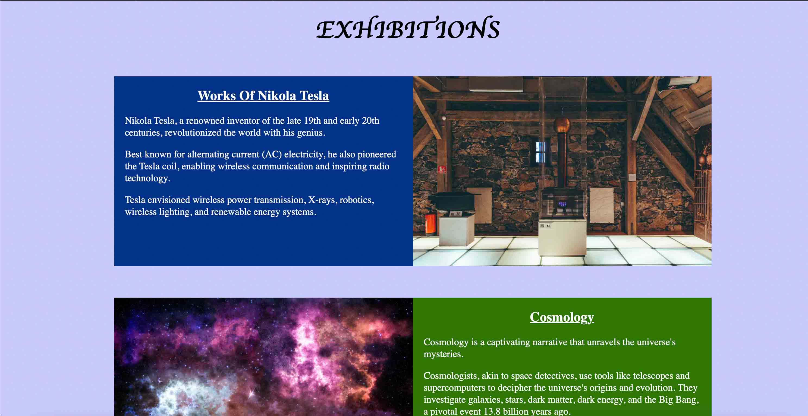
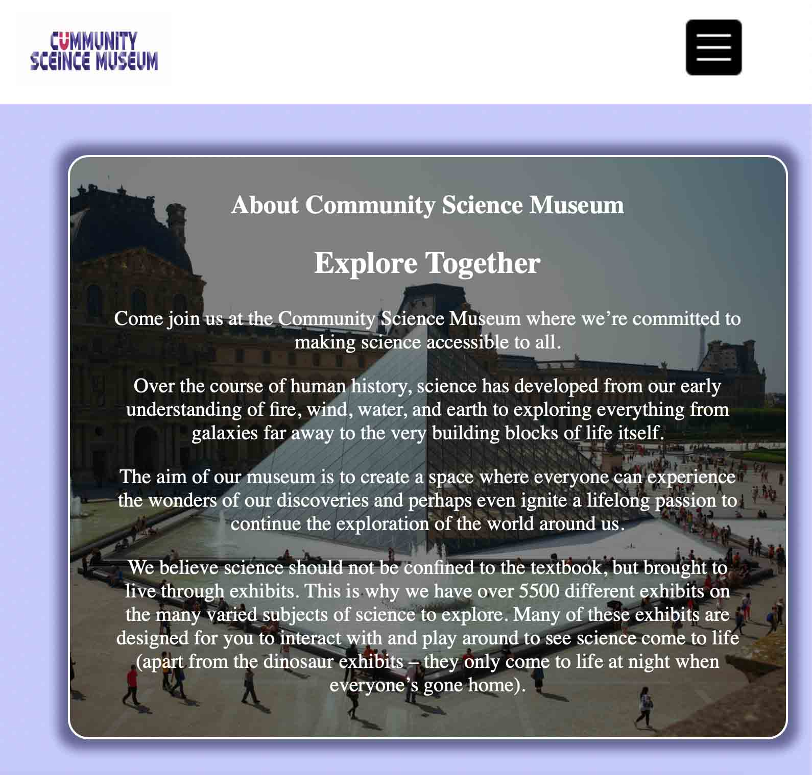
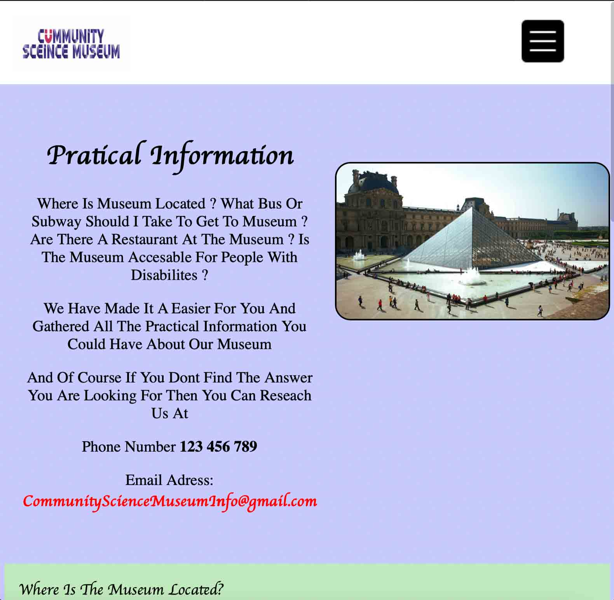
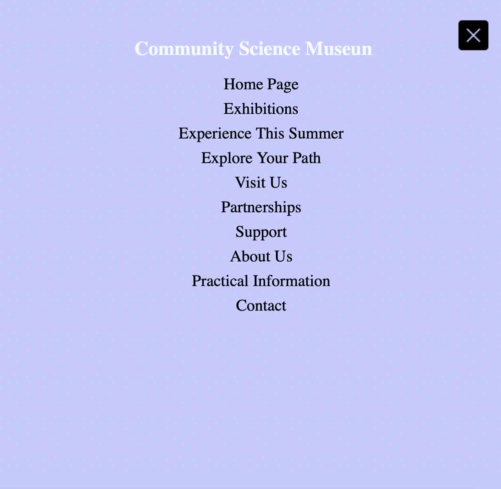

# Community-Science-Museum

[GitHub Pages Link](https://akb-official.github.io/Community-Science-Museum/).

## CREATED WITH
```
- HTML
- CSS
- JavaScript
- Figma 
- VS Code
- Github & Github Pages
```

## Pictures / Icon / Fonts / Content From
```
- All Images From UNSPLASH
- Logo Created With BRANDMARK
- Text Created With ChatGPT
- Fonts From Google Fonts
```

## What is Community Science Museum 
- Community Science Museum is a project exam I had in my first semester at Noroff Bergen.
- Is A Website For A Fictional Museum Located In Coney Island, New York City, USA

## How Does Community Science Museum Look Like For Desktop / Laptop Size Devices ?
**Home Page Top**

**Home Page Bottom**

**Exhibition Page**


## How Does Community Science Museum Look Like For Phone Size Devices ?
**About Page**

**Pratical Information Page**

**Menu On Phone / Tablet**
